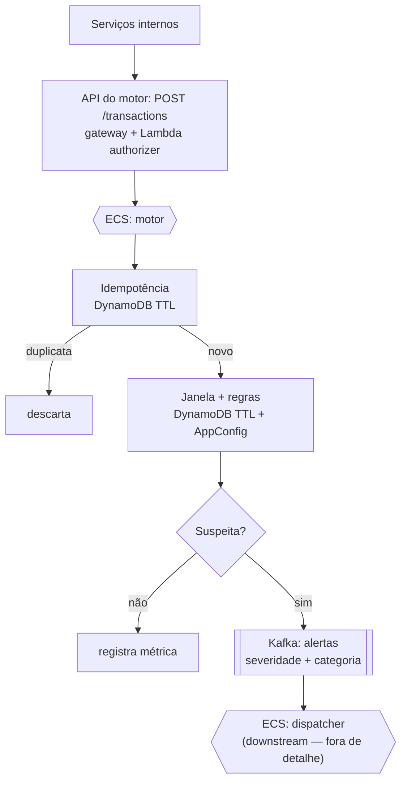
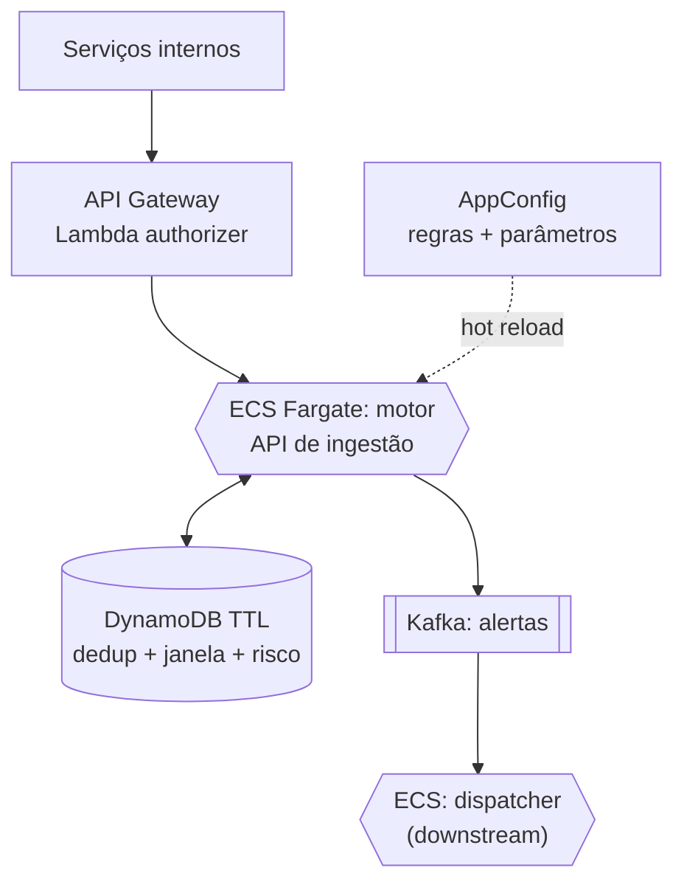
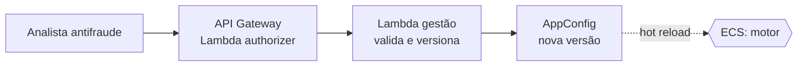

# Motor de detecção de transações suspeitas — proposta técnica

## 1. Contexto e escopo

O módulo identifica transações suspeitas em tempo real, recebendo eventos de outros serviços internos e produzindo alertas classificados. A meta operacional é 8.000 TPS de regime, com pico de 25.000 TPS, e latência de alerta de até 500 ms.

Três decisões de escopo orientam o desenho:

O motor é **observacional, não bloqueia**. O desafio pede detectar e alertar, não autorizar a transação. Por isso o motor fica fora do caminho crítico do pagamento; os 500 ms medem do recebimento da transação à publicação do alerta.

A entrada é **por uma API que o próprio motor expõe**. Os serviços internos chamam essa API para submeter transações. Como cada origem tem seu formato, a API impõe um contrato canônico e valida/normaliza o payload na borda. A autenticação usa o gateway com Lambda authorizer para validar o token antes de a requisição chegar ao motor.

O documento **detalha o motor até a publicação do alerta**, que é consumido por um dispatcher a jusante. O dispatcher e o que vem depois dele (roteamento aos públicos, enriquecimento, notificação) são deliberadamente **fora do detalhe desta proposta** — aparecem apenas como fronteira.

## 2. Fluxograma



O ponto central é a separação de responsabilidades: o motor decide *que* uma transação é suspeita e publica esse fato; o dispatcher (a jusante) decide o que fazer com o alerta. Este documento para na publicação do alerta.

## 3. Arquitetura AWS

### 3.1 Plano de dados



O tráfego entra pelo API Gateway (autenticação no Lambda authorizer) e chega ao motor no ECS Fargate via VPC Link. O motor mantém estado efêmero no DynamoDB (idempotência, janela e perfil de risco), carrega regras e parâmetros do AppConfig com hot reload, e publica alertas no Kafka corporativo (Kafka as a service), consumido pelo dispatcher a jusante. Transversal a todo o fluxo: **segurança** com KMS (repouso), TLS (trânsito) e IAM (auth entre serviços); **SRE** com CloudWatch (métricas, logs, alarmes) e X-Ray (tracing).

### 3.2 Plano de controle (gestão de regras)



Separar plano de controle de plano de dados garante que a gestão de regras nunca compete por recurso com o caminho crítico dos 500 ms. A validação no AppConfig (JSON Schema) protege o plano de dados de uma configuração quebrada, com rollback de versão. O mesmo AppConfig alimenta consumidores a jusante (o dispatcher), fora do escopo deste documento.

## 4. Descrição detalhada de cada passo

### Passo 1 — Ingestão via API
Os serviços internos chamam `POST /transactions` na API que o motor expõe. O API Gateway valida o token no Lambda authorizer; o motor valida o payload contra o contrato canônico e rejeita o que estiver malformado (4xx). É aqui que se resolve a entrada plural: qualquer origem que fale o contrato é aceita, e a normalização acontece na borda.

### Passo 2 — Admissão e paralelismo por cliente
Recebida a transação, o motor a roteia internamente por `customer_id` (hash → worker), o que preserva ordem por cliente e paraleliza entre clientes. Como a ingestão agora é síncrona por API (e não um tópico particionado), a ordenação por cliente é responsabilidade do motor, não do broker — ver o trade-off na seção 6. A API pode responder de forma síncrona (com o veredito) ou aceitar e processar de forma assíncrona (202), conforme a necessidade de latência do chamador.

### Passo 3 — Idempotência
Antes de qualquer trabalho caro, o motor verifica se a transação já foi processada, consultando o DynamoDB por uma chave determinística (`customer_id + transaction_id`). Duplicata é descartada. Fazer isso primeiro evita reprocessar e evita alerta duplicado — importante porque um chamador de API pode reenviar em retry.

### Passo 4 — Avaliação de janela e regras
O motor mantém, no DynamoDB com TTL, uma janela deslizante por cliente, e resolve os parâmetros de risco do cliente (com default global). As regras vêm do AppConfig e são avaliadas contra três camadas: o evento, a janela recente e o `customer_risk`. Cada regra declara de quais camadas depende (`requires`), o que habilita o **modo degradado**: se um store oscilar, as regras que só pedem `event` continuam rodando, as que pedem a camada ausente são puladas, e o alerta sai marcado como parcial. Perfil de risco ausente ou store fora ⇒ usa o default.

### Passo 5 — Decisão
Se nenhuma regra dispara, registra-se métrica e encerra. Se dispara, o motor agrega: a `severity` é a maior entre as regras disparadas e as `categories` são a união. É aqui que nascem a severidade e a categoria que o consumidor a jusante usará.

### Passo 6 — Publicação do alerta
O motor publica no tópico `alertas` um evento com a classificação (`severity`, `categories`), o score, as regras disparadas e um `alert_id` determinístico. O tópico é retido (replay de graça), por isso **não** carrega PII de contato, apenas identificadores. **Esta é a fronteira do motor**: a partir daqui, o dispatcher consome o alerta e decide o que fazer — fora do detalhe deste documento.

### Resiliência do motor
A indisponibilidade de um store de estado degrada, mas não derruba: `customer_risk` fora cai no default; janela fora pula as regras dependentes e marca o alerta como parcial. A publicação do alerta é a única dependência dura de saída; uma falha ali é tratada com retry e, se necessário, uma fila de reprocesso interna, para não perder detecção.

## 5. Modelagem das integrações (escopo do motor)

Convenções: identificadores de entidade (`customer_id`, `transaction_id`, `device_id`) são **UUID**; a chave de deduplicação `alert_id` é **SHA-256** sobre serialização fixa e versionada, `sha256("v1|" + customer_id + "|" + transaction_id + "|" + window_bucket)`. Os contratos a jusante do dispatcher (política de roteamento, enriquecimento, notificação) não são detalhados aqui.

### Serviços internos → API do motor (ingestão)
```
POST /transactions
Headers: Authorization: Bearer <token>   # validado no Lambda authorizer
         X-Trace-Id: <uuid>
Body:
{
  "customer_id": "b1c4e2a0-7f33-4d9a-9b21-2e5f8c0a4d17",
  "transaction_id": "7a91f0e3-2c14-4b8d-8e6a-9f02c1d34b57",
  "amount": 1899.90,
  "currency": "BRL",
  "channel": "pix",
  "device_id": "9d2f7c31-4a86-4f1e-bb0c-1a3e6d5b8f92",
  "geo": { "country": "BR", "lat": -23.55, "lon": -46.63 },
  "captured_at": "2026-08-24T14:03:11.100Z"
}

# Resposta síncrona
200 { "suspicious": true, "alert": { ... } }
200 { "suspicious": false }
200 { "status": "duplicate" }
# ou, em modo assíncrono
202 { "status": "accepted", "trace_id": "<uuid>" }
400 { "error": "payload inválido", "details": [ ... ] }
```

### Motor ↔ DynamoDB (TTL)
Três famílias de item na mesma tabela, sem banco durável.
```
// idempotência
PK = "IDEMP#<customer_id>#<transaction_id>"
{ processed_at: 1756044191, ttl: 1756047791 }

// janela deslizante (um item por transação recente)
PK = "WIN#<customer_id>"
SK = "<epoch>#<transaction_id>"
{ amount: 1899.90, country: "BR", device_id: "<uuid>", ttl: 1756045091 }

// perfil de risco (opcional por cliente, sem TTL)
PK = "RISK#<customer_id>"
{ limite_valor: 15000, nivel: "private", updated_at: 1756044000 }
```
A regra de velocidade faz um Query em `WIN#<customer_id>` limitado por tempo e conta; o TTL expira o que envelhece, sem job de limpeza. **Invariante**: o TTL dos itens da janela deve ser ≥ o maior `window.span_seconds` entre todas as regras (mais margem), senão o dado expira antes de a regra poder olhá-lo.

### AppConfig → definição de regra
Contrato que sustenta o "sem redeploy". Declara as camadas de que depende, a expressão e o que emite.
```json
{
  "rule_id": "velocidade-pix",
  "version": 4,
  "enabled": true,
  "requires": ["event", "window"],
  "window": { "span_seconds": 300, "type": "count" },
  "condition": "window.count_channel_pix > 8",
  "emits": { "severity": "alta", "category": "velocidade" },
  "owner": "antifraude"
}
```
`window.span_seconds` é o intervalo recente que a regra observa (aqui, 5 min); `type` é a operação sobre a janela (`count`, `sum`, `distinct`). Uma regra pode depender de `customer_risk`, mantendo a lógica geral e trazendo só o **valor** do limiar por cliente:
```json
{
  "rule_id": "valor-atipico",
  "version": 2,
  "enabled": true,
  "requires": ["event", "customer_risk"],
  "condition": "amount > risk.limite_valor",
  "emits": { "severity": "media", "category": "valor" },
  "owner": "antifraude"
}
```
`requires` habilita o modo degradado: `customer_risk` indisponível ou cliente sem perfil ⇒ usa o default; janela indisponível ⇒ regra pulada e alerta parcial.

### AppConfig → parâmetros operacionais
Ajustes gerais mutáveis sem redeploy; contém o **default global de risco**, aplicado a todo cliente sem perfil próprio e como fallback quando o store de risco está fora.
```json
{
  "version": 5,
  "window": { "max_items_per_customer": 200 },
  "thresholds": { "score_minimo_alerta": 0.6 },
  "default_customer_risk": { "limite_valor": 5000, "nivel": "padrao" }
}
```
O `default_customer_risk` é um único valor geral e versionado — mudar o limiar-base de todos os clientes sem perfil é operação auditável e reversível (rollback de versão), não um UPDATE espalhado no banco.

### Motor → Kafka `alertas`
Saída do motor e fronteira com o dispatcher. Sem PII de contato; `alert_id` em SHA-256.
```json
{
  "alert_id": "sha256:8f3a...c21b",
  "customer_id": "b1c4e2a0-7f33-4d9a-9b21-2e5f8c0a4d17",
  "transaction_id": "7a91f0e3-2c14-4b8d-8e6a-9f02c1d34b57",
  "severity": "alta",
  "categories": ["velocidade", "geo"],
  "score": 0.87,
  "triggered_rules": [{ "rule_id": "velocidade-pix", "version": 4 }],
  "evaluation": "partial",
  "degraded": ["window"]
}
```

### Plano de controle → API de gestão de regras
Entra pelo gateway com Lambda authorizer; a Lambda valida contra o JSON Schema da definição de regra antes de publicar no AppConfig.
```json
{
  "action": "upsert_rule",
  "rule": { },
  "expected_current_version": 3,
  "actor": "analista-id"
}
```
`expected_current_version` dá optimistic locking entre analistas.

### Princípio de minimização (LGPD)
No escopo do motor, o único dado que trafega é o necessário para detectar: a ingestão traz os campos da transação, e o alerta publicado carrega apenas identificadores e classificação — nunca contato ou nome. A minimização de PII está na modelagem, não num passo posterior de mascaramento. Dados identificáveis do cliente (nome, conta) só entram a jusante, no dispatcher — fora deste documento.

## 6. Decisões e trade-offs

**Entrada por API síncrona vs. buffer de fila.** A API expõe o motor diretamente, mas perde a ordenação por partição que um tópico daria. Como as regras de janela exigem ordem por cliente, há duas saídas: (a) a API aceita (202) e enfileira internamente num stream particionado por `customer_id`, que o motor consome — restaura ordem e vira amortecedor de pico, ao custo de um hop interno; ou (b) aceitar reordenação leve e tornar o append da janela tolerante a ordem (idempotente por `transaction_id`+tempo). A opção (a) é a robusta para produção; (b) é aceitável para o MVP. Em ambas, o motor roteia por `customer_id` internamente.

**At-least-once + idempotência.** Um chamador de API pode reenviar em retry; a idempotência no DynamoDB absorve a duplicata. Mais simples e barato que qualquer garantia exactly-once.

**Sem banco durável.** DynamoDB com TTL cobre idempotência e janela; é serverless, escala para o pico e expira estado sozinho. Alternativa consciente: ElastiCache/Redis se a latência da janela pesar no orçamento de 500 ms.

**Estado de janela é efêmero.** Se uma task reinicia, a janela reidrata em minutos. Caminho de recuperação para mais robustez: reprocessar de um stream interno a partir de um offset recente.

**Default de risco no AppConfig, não no DynamoDB.** O default é valor único e geral (política); o DynamoDB guarda só os clientes com parâmetro personalizado. Um único caminho de fallback cobre "cliente sem perfil" e "store de risco fora".

**Regras e parâmetros como configuração versionada** no AppConfig, com validação e rollback — extensibilidade sem redeploy, com a equipe antifraude como dona.

## 7. Capacidade e orçamento de latência

Com ingestão por API, a escala é horizontal: múltiplas tasks do motor no ECS Fargate atrás do balanceador, escalando por taxa de requisições e latência (não por consumer lag). O orçamento de 500 ms cobre da requisição recebida à publicação do alerta: validação, idempotência, avaliação de regras (evento + Query de janela + lookup de risco) e publish. O pico de 25k TPS é absorvido pela resposta 202 com processamento assíncrono interno e backpressure (opção (a) da seção 6), evitando que um surto derrube o front door. A ordenação por cliente é mantida pelo roteamento interno por `customer_id`.

## 8. Estratégia de testes e observabilidade

**Testes.** Regras em testes de tabela (evento + janela + risco na entrada, severidade/categoria esperadas na saída). Modo degradado (janela fora ⇒ regra pulada, alerta parcial; risco fora ⇒ default). Idempotência (duplicata processada uma vez). Determinismo do `alert_id`. Contrato da API de ingestão (`httptest`: payload válido, inválido, duplicata). Config inválida rejeitada mantendo a última versão boa. Teste de carga com k6 contra a API para validar o orçamento de latência no pico.

**Observabilidade (SRE).** Métricas de TPS de ingestão, p99 de latência (requisição → alerta), taxa de alertas, taxa de duplicatas, avaliações parciais por camada degradada, e `rule_version`/`params_version` ativos. SLOs sobre p99 e taxa de erro da API, com runbook para os cenários de store de estado indisponível e pico sustentado.
